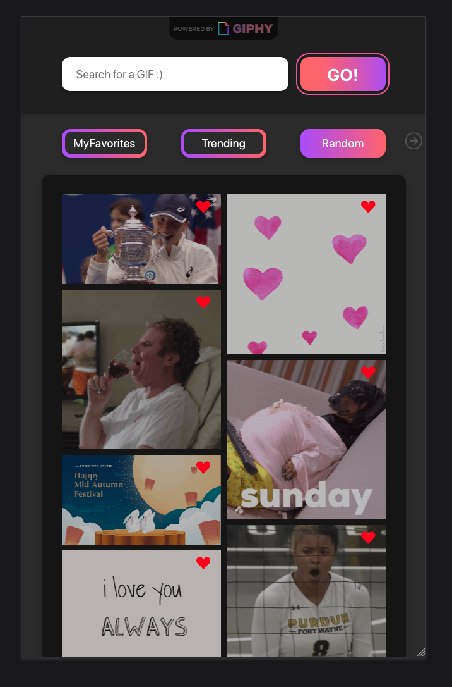

# Never Gonna GIF You Up

This application was made as a final project for the SPA-module at DCI.

It includes fetching data from the GIPY API as well as the imgflip API for the meme generator. You can search for specific GIFs, fetch a collection of trending GIFs or get a single random one. While waiting for the response of the API a loading spinner is displayed. The spinner was taken from <a href="https://www.davidhu.io/react-spinners/" target="_blank">David Hu's</a> amazing react spinner package.

Every GIF item allows you to add your favorite GIFs to the "Favorites" section by clicking on the heart icon, where they will be stored in the localStorage of your browser. The application checks which GIFs are already marked as favorites and prevents adding them again, by disabling the heart icon. When a new GIF is added to your favorites, a notifiaction will appear displaying the name of the GIF and confirm the event.

The app contains a meme generator, which lets you fetch a random meme template and add your own description to. The text container are draggable and resizeable to fit the current template.

Additionally a toggle lets you switch between light and dark mode.

Special attention was paid to a fully responsive design.

<strong><a href="https://never-gonna-gif-you-up.netlify.app/" target='_blank'>Watch the live version on Netlify 🎉</a></strong>

 

